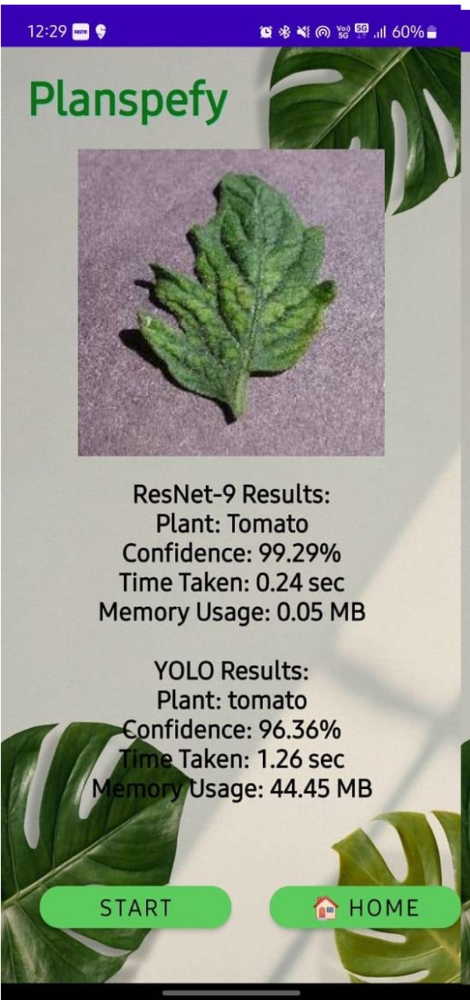
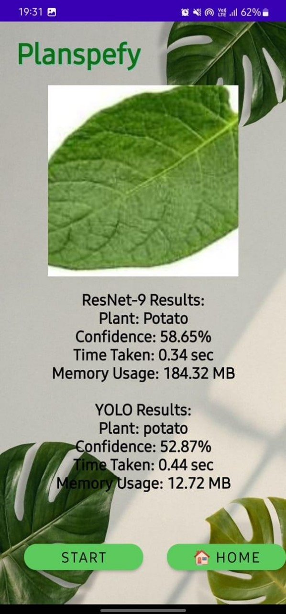

 # Plantify: Plant Recognition using ResNet and YOLO

Technologies and Tools Used :
- Android Studio (Kotlin)  
- Python (TensorFlow/Keras, PyTorch)  
- ResNet, Sequential CNN, and YOLO models  
- ONNX / TensorFlow Lite for model conversion  
- Gradle for dependency management  
- Git & GitHub for version control  
---
 Features of the App :

- On the **home page**, the app displays plant recognition comparisons using different models (Sequential CNN, ResNet, and YOLO).  
- Each test shows the **time taken**, **memory used**, and the **predicted plant type**.  
- Demonstrates the **vanishing gradient problem** in Sequential CNNs and how **ResNet’s residual connections improve accuracy and efficiency**.  
- Results are stored inside the app for later viewing.  
- A clean interface is provided for testing and comparing outputs in real time.  
---
 Demo Images of the App :

  
  

